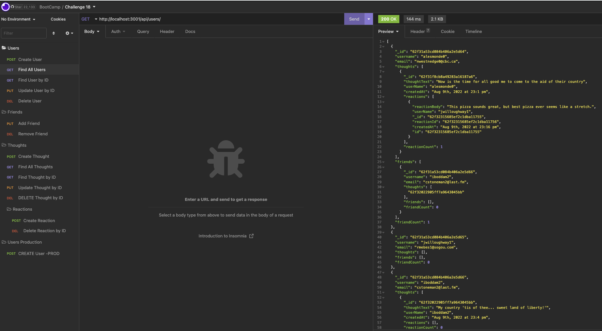
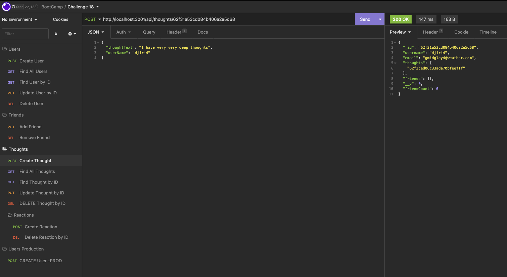
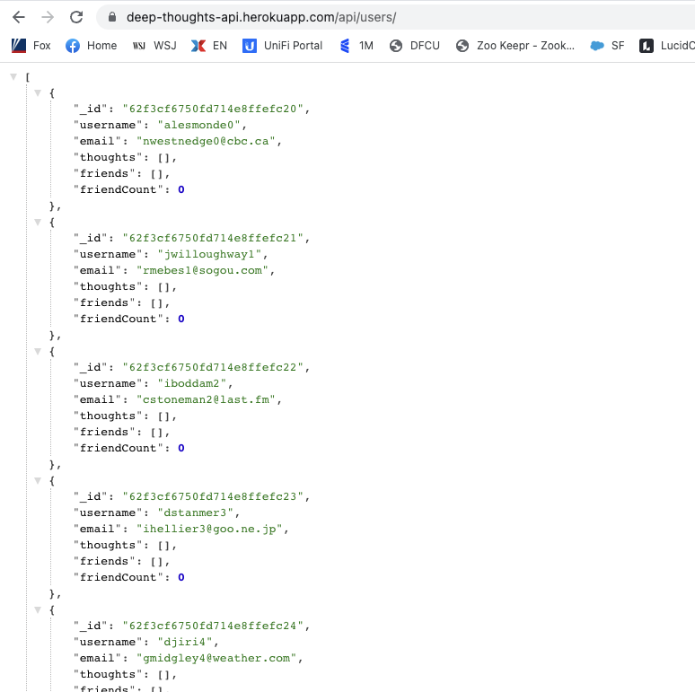

<h1 align="center">Deep Thoughts Social Media API 👋</h1>
  
<p align="center">
    
    
    
    
    <a href="https://github.com/rstanbaugh">
    </a>
</p>
  
<p align="center">
    
    
    
    
    
</p>

<br>

   ## Table of Contents
- [Table of Contents](#table-of-contents)
- [Description](#description)
- [Video Links](#video-links)
- [User Story](#user-story)
- [Acceptance Criteria](#acceptance-criteria)
- [Installation](#installation)
- [Usage](#usage)
- [Contributing](#contributing)
- [Questions](#questions)

<br>

## Description

🔍 Deep Thoughts is an API for a social network web where users can add friends and share thoughts / reactions.

**[Deployed Deep Thoughts API](https://deep-thoughts-api.herokuapp.com/api/users/)**

## Video Links
  [Part 1](https://watch.screencastify.com/v/MPmvrKKQPbDPOM5dYLq5)<br>
  [Part 2](https://watch.screencastify.com/v/2N6yeuX2XmL72iNO7TlS)<br>

💻 <br>
Deep Thoughts API Screenshots:
  



<br>

## User Story
```
AS A social media startup
I WANT an API for my social network that uses a NoSQL database
SO THAT my website can handle large amounts of unstructured data
```

## Acceptance Criteria
```
GIVEN a social network API

WHEN I enter the command to invoke the application
THEN my server is started and the Mongoose models are synced to the MongoDB database

WHEN I open API GET routes in Insomnia Core for users and thoughts
THEN the data for each of these routes is displayed in a formatted JSON

WHEN I test API POST, PUT, and DELETE routes in Insomnia Core
THEN I am able to successfully create, update, and delete users and thoughts in my database

WHEN I test API POST and DELETE routes in Insomnia Core
THEN I am able to successfully create and delete reactions to thoughts and add and remove friends to a user’s friend list
```
<br>
   

## Installation
💾   <br>
`npm init`<br>
`npm install`
  
## Usage
💻   
  
Run the following command at the root of your project and answer the prompted questions:
  
Start the application:<br>
`npm start`<br>

## Contributing
[Rich Stanbaugh](https://github.com/rstanbaugh)<br>
Code from Module 18 - Pizza-Hunt

## Questions
✉️ Contact me with any questions: [email](mailto:rstanbaugh@gmail.com.com) , [GitHub](https://github.com/rstanbaugh)<br />